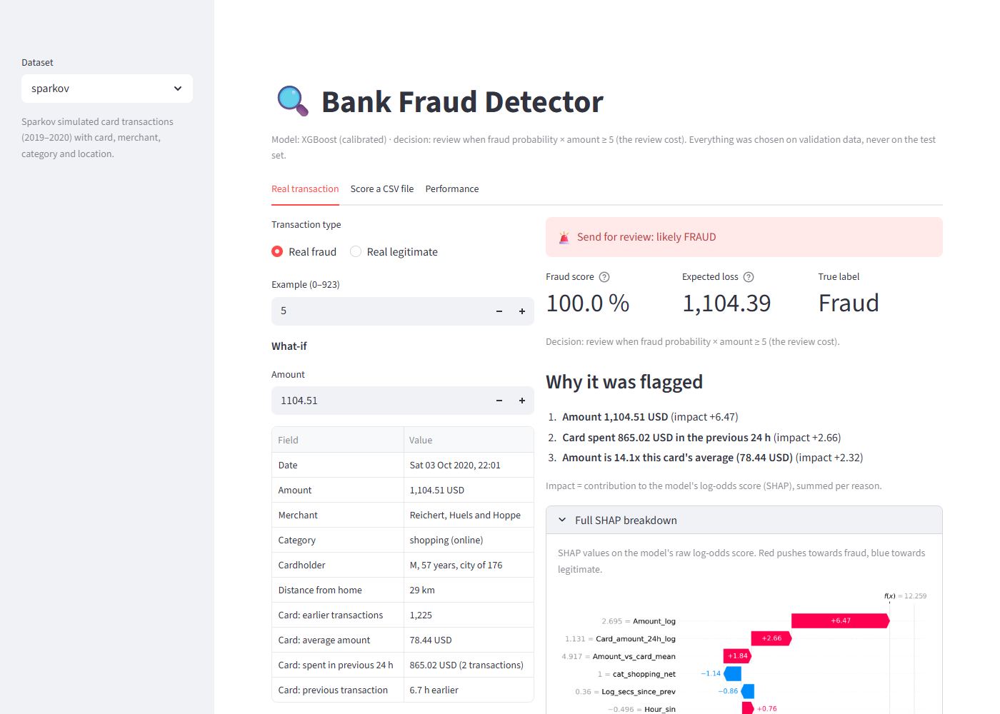
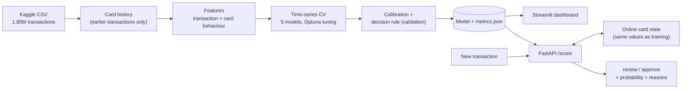

# 🔍 Bank Fraud Detection

[](https://github.com/khalil-codess/bank-fraud-detection/actions/workflows/ci.yml)

[](LICENSE)

[](https://bank-fraud-detection-z52g4u2mehujkb9ppintqd.streamlit.app/)

An end-to-end card-fraud detection system, built and evaluated the way a bank would run it:
models trained on the past and tested on the future, decisions measured in money saved, every
alert explained in plain language, and a real-time API whose features match training exactly.

**▶ [Try the live demo](https://bank-fraud-detection-z52g4u2mehujkb9ppintqd.streamlit.app/)**: real test-period frauds, their reasons, a what-if on the
amount, CSV scoring and the full evaluation.

**On the last 90 days of 1.85M card transactions (924 frauds worth 483,346 USD):**

| | |
|---|---|
| Fraud money stopped | **99.8%** |
| Net savings after a 5 USD review cost per alert | **476,033 USD (98.5% of fraud losses)** |
| Alerts raised | **1,276** in 90 days (~14 a day), **69%** of them real frauds |
| With 10 reviews a day | top alerts are **95%** frauds and catch **93%** of them |
| PR-AUC (95% CI) | **0.980** (0.974 – 0.985) |
| Scoring latency, one transaction with its reasons | **44 ms** median |



## What makes it different

- **Honest evaluation.** Chronological train / validation / test split, rolling time-series
  cross-validation, model and decision rule chosen on validation only, the test period scored
  once, bootstrap confidence intervals and paired model comparisons.
- **Card history, without leaking the future.** Velocity, spending in the last 24 h, amount vs
  the card's usual amount, first visit to a merchant, travel speed between purchases: computed
  from each card's *earlier* transactions only. Tests prove that a transaction's features are
  bit-for-bit identical whether or not later data exists. This took PR-AUC from 0.855 to 0.968.
- **Decisions in money, not accuracy.** Calibrated probabilities make the cost-optimal rule
  possible: *review when probability × amount ≥ review cost*. A 2,000 USD purchase at 5% risk
  is reviewed, a 10 USD one at 30% is not.
- **Every alert explained.** *"Card spent 865.02 USD in the previous 24 h"*, *"Amount is 14.1x
  this card's average (78.44 USD)"*: SHAP contributions turned into sentences, which add up
  exactly to the model's score.
- **Production-ready serving.** A FastAPI service keeps each card's history online, and replaying
  2,000 real transactions through it gives scores identical to offline batch scoring (difference
  0.0). Packaged with Docker; CI runs 120 tests on Python 3.11 and 3.13.
- **Problems documented, not hidden.** Fabricated metrics in the first version were replaced by
  measured ones, LightGBM's divergence on imbalanced data was diagnosed and fixed, and the model's
  use of age and gender is flagged in every alert, with the cost of removing them measured
  ([details](docs/RESULTS.md#protected-attributes-age-and-gender)).

## How it works



## Quick start

No install needed: [live demo](https://bank-fraud-detection-z52g4u2mehujkb9ppintqd.streamlit.app/). To run it yourself, everything (API + dashboard) with Docker:

```bash
docker compose up --build
# API docs:  http://localhost:8000/docs
# Dashboard: http://localhost:8502
```

Or locally, with Python 3.11+:

```bash
pip install -e ".[app,api,dev]"
streamlit run app.py                                  # dashboard, uses the committed models
pytest                                                # 120 tests
```

To retrain, download the [Sparkov data](https://www.kaggle.com/datasets/kartik2112/fraud-detection)
(`fraudTrain.csv` and `fraudTest.csv`) into `data/raw/sparkov/`, then:

```bash
python -m fraud.train --config configs/sparkov.yaml   # ~15 min: CV, 5 models, calibration
python -m fraud.tune --model XGBoost --trials 40      # optional Optuna search
python -m fraud.benchmark                             # replay test transactions through the API
```

No Kaggle account? `python -m fraud.synthetic --dataset sparkov --rows 20000 --out data/synthetic.csv`
then `python -m fraud.train --data data/synthetic.csv`.

## Scoring API

```bash
curl -X POST localhost:8000/score -H "Content-Type: application/json" -d '{
  "card_id": 3517814635263522, "timestamp": "2021-01-02T02:13:00", "amount": 1250.00,
  "merchant": "Never Seen Ltd", "category": "shopping_net", "gender": "M", "dob": "1941-10-16",
  "lat": 37.5802, "long": -80.5248, "city_pop": 2443, "merch_lat": 38.1802, "merch_long": -79.8248}'
```

```json
{
  "decision": "review",
  "fraud_probability": 0.0201,
  "expected_loss": 25.09,
  "rule": "expected_value",
  "reasons": [
    {"text": "Amount 1,250.00 USD", "impact": 4.42, "protected": false},
    {"text": "Amount is 19.7x this card's average (63.59 USD)", "impact": 1.72, "protected": false},
    {"text": "0 other transactions on this card in the previous hour, 0 in 24 h, 29 in 7 days",
     "impact": 0.22, "protected": false}
  ],
  "card_transactions_before": 1462
}
```

A real card from the dataset (1,462 earlier transactions, usually 63.59 USD), a new 1,250 USD
online purchase at 2 a.m. The fraud probability is only 2%, but 2% of 1,250 USD is 25.09 USD,
more than the 5 USD review cost, so it goes to review. (Response shortened; it also returns latency and model
version.)

## Documentation

- [**Detailed results**](docs/RESULTS.md): progress across steps, all models, cross-validation,
  calibration, decision rules, reason codes, protected attributes, and the classic Kaggle
  `creditcard` benchmark.
- [**Engineering notes**](docs/ENGINEERING.md): training/serving consistency, latency profiling,
  production notes, design decisions, known limitations.

## Project layout

```
src/fraud/
  datasets/      one module per dataset: loader, features, reason sentences, synthetic data
  history.py     point-in-time card history (batch, for training)
  state.py       the same card history, online, one transaction at a time (API)
  train.py       training: CV, model selection, calibration, decision rule, artifacts
  evaluate.py    cost model, thresholds, precision@k, bootstrap tests
  validation.py  rolling time-series cross-validation
  calibration.py Platt scaling and calibration metrics
  tune.py        Optuna search inside the training window
  reasons.py     plain-language reason codes from SHAP
  api.py         FastAPI scoring service
  benchmark.py   latency and training/serving consistency check
app.py           Streamlit dashboard
configs/         one YAML per dataset: split, costs, CV, model hyper-parameters
artifacts/       trained models + metrics.json (committed)
tests/           120 tests: leakage, exact online/batch parity, API, end-to-end training
```

## Datasets

| Name | Source | Size | Role |
|---|---|---|---|
| `sparkov` | [kartik2112/fraud-detection](https://www.kaggle.com/datasets/kartik2112/fraud-detection) | 1.85M transactions, 2019–2020 | Main dataset: card, merchant and location fields allow behavioural features. **Simulated**, so scores are higher than a real bank would see. |
| `creditcard` | [mlg-ulb/creditcardfraud](https://www.kaggle.com/datasets/mlg-ulb/creditcardfraud) | 284,807 transactions, 2 days | Classic benchmark, real but anonymised into PCA components ([results](docs/RESULTS.md#creditcard-dataset)). |

## Roadmap

Done: leak-free evaluation · package, tests, CI · cost-based evaluation · Sparkov dataset ·
card-history features · tuning, calibration, expected-value rule · reason codes · FastAPI +
Docker.

---

Mohamed Khalil Kouki · [MIT License](LICENSE) · Joblib model files run code when loaded: only load
models you trust.
