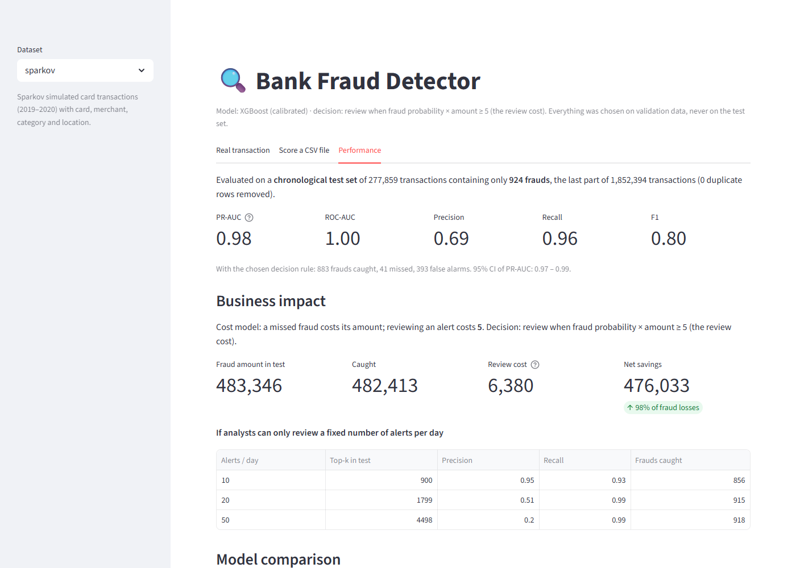

# Detailed results

Every number here is regenerated by `python -m fraud.train` into `artifacts/<dataset>/metrics.json`;
the figures are in `outputs/<dataset>/`. [Back to the README](../README.md)

## `sparkov` dataset

Chronological split of 1.85M transactions: train → validation → **test = the last 90 days
(277,859 transactions, 924 frauds worth 483,346 USD)**.

### Card-history features

Real fraud systems look at the card's behaviour, not just the transaction. For every transaction,
`src/fraud/history.py` summarises **only the card's earlier transactions**: counts in the last
1 h / 24 h / 7 days, amount spent in the last 24 h, the card's usual amount (mean and spread),
time since its previous purchase, earlier visits to this merchant and category, and the distance
and speed from the previous purchase. Model features compare the current transaction with that
history (e.g. *amount ÷ card's usual amount*).

Two guarantees are enforced by tests (`tests/test_history.py`):
- **no look-ahead**: a transaction's history is bit-for-bit identical whether later data exists
  or is altered;
- **no labels**: fraud labels are never used (in production they arrive weeks later).

### Tuning, calibration and an expected-value decision rule

- **Tuning** (`python -m fraud.tune`): Optuna searches hyper-parameters inside the training
  window only (fit on its older 80%, score PR-AUC on its most recent 20%), then the winners are
  copied into `configs/sparkov.yaml`. XGBoost: 0.980 → 0.985 on the tuning holdout, and the gain
  carried over to cross-validation (0.970 → 0.982). **LightGBM's did not** (0.985 on the tuning
  holdout, 0.961 in CV): tuning ran on 20% of the legitimate rows for speed, and size-dependent
  settings (7 samples per leaf) behave differently on the full data. Cross-validation caught it.
- **A LightGBM pitfall**: with a large class weight, LightGBM's default minimum hessian per leaf
  (0.001) let leaf values explode on the creditcard data: training stopped after 46 of 400 trees
  with PR-AUC 0.02. The project now uses XGBoost's default (1.0), with a regression test.
- **Calibration**: the selected model's scores go through Platt scaling fitted on validation
  data. It is strictly increasing, so ranking, PR-AUC and SHAP are unchanged, but a score now
  reads as a probability: raw scores were over-confident in the 45–85% range, calibrated ones
  follow the diagonal (`outputs/sparkov/calibration.png`).
- **Decision rule**: with real probabilities, the cost-optimal rule is *review a transaction when
  probability × amount ≥ review cost*. A 2,000 USD purchase at 5% risk gets reviewed, a 10 USD one
  at 30% does not. It is compared on validation with a single best threshold, and it wins there
  (637,234 vs 635,839 USD) and on the test period:

| Decision rule (test period) | Alerts | Precision | Frauds caught | Fraud amount stopped | Net savings |
|---|---|---|---|---|---|
| Single score threshold (best on validation) | 1,200 | 0.75 | 901 / 924 | 99.4% | 474,338 USD (98.1%) |
| **probability × amount ≥ 5 USD** ✓ | 1,276 | 0.69 | 883 / 924 | **99.8%** | **476,033 USD (98.5%)** |

The expected-value rule catches *fewer* frauds but *more money*: it lets through tiny frauds whose
loss is smaller than the cost of reviewing them, and reviews large purchases even at low risk.

### Progress across steps (selected model, held-out test period)

| | Transaction only | + card history | + tuning, calibration, EV rule |
|---|---|---|---|
| Selected model | Random Forest | XGBoost + SMOTE | **XGBoost (calibrated)** |
| PR-AUC (95% CI) | 0.855 (0.835 – 0.875) | 0.968 (0.959 – 0.974) | **0.980 (0.974 – 0.985)** |
| Alerts in 90 days | 1,929 | 1,824 | **1,276** |
| Precision of alerts | 0.43 | 0.50 | **0.69** |
| Fraud amount stopped | 98.4% | 99.8% | **99.8%** |
| Net savings | 466,185 USD (96.4%) | 473,172 USD (97.9%) | **476,033 USD (98.5%)** |
| 10 reviews/day: precision / recall | 0.82 / 0.80 | 0.93 / 0.91 | **0.95 / 0.93** |

From the first to the last column, analysts get a third fewer alerts, and two thirds of them are
real frauds instead of four in ten.

### Reason codes

Every alert comes with its top three reasons in plain language, built from the transaction's own
values (`src/fraud/reasons.py`). A real fraud from the test period:

> **Send for review**, fraud probability 100%, expected loss 1,104.39 USD
> 1. Amount 1,104.51 USD
> 2. Card spent 865.02 USD in the previous 24 h
> 3. Amount is 14.1x this card's average (78.44 USD)

SHAP contributions of related features are summed into reason groups (the two time-of-day
features become "Made at 22:45 (night)", the 14 category columns become "Merchant category:
groceries (in store)"). Because SHAP is additive, the groups plus the base value equal the
model's score exactly, and a test checks it. The dashboard shows the reasons for single
transactions and adds a `reasons` column when scoring a CSV.

### Protected attributes: age and gender

The Sparkov model uses the cardholder's **age and gender**. Reason codes made this visible: one or
the other is among the top three reasons of **3.4% (age) and 4.3% (gender)** of the 1,276
alerts in the test period. In the dashboard and in CSV exports these reasons are marked
*protected attribute*.

Removing both features was measured (tuned XGBoost, best single threshold on validation, test
period):

| | With age & gender | Without |
|---|---|---|
| PR-AUC | 0.980 | 0.966 |
| Alerts | 1,200 | 1,880 |
| Precision | 0.75 | 0.48 |
| Net savings | 474,338 USD (98.1%) | 471,558 USD (97.6%) |

**Decision for this project: keep them, and document it.** This is a portfolio project on
simulated data, and the Sparkov generator builds its fraud patterns from customer profiles, so
part of this signal is likely an artifact of the simulator. A real bank could not do this: in
the EU and the US, age and gender cannot justify treating a customer differently. It would have
to drop both features and accept about 680 more alerts per 90 days (+57%) for 2,800 USD less
savings.

### All models (card history, tuned)

**Time-series cross-validation (4 folds, mean ± std)**

| Model               | PR-AUC        | Savings rate     | Recall        | Precision     |
|---------------------|---------------|------------------|---------------|---------------|
| Logistic Regression | 0.372 ± 0.055 | 90.9% ± 0.5%     | 0.840 ± 0.045 | 0.208 ± 0.029 |
| Random Forest       | 0.942 ± 0.016 | 97.3% ± 0.6%     | 0.956 ± 0.018 | 0.564 ± 0.054 |
| **XGBoost** ✓       | 0.982 ± 0.007 | **98.0% ± 0.3%** | 0.980 ± 0.011 | 0.690 ± 0.078 |
| LightGBM            | 0.961 ± 0.002 | 96.7% ± 0.5%     | 0.968 ± 0.013 | 0.611 ± 0.104 |
| XGBoost + SMOTE     | 0.981 ± 0.007 | 97.9% ± 0.4%     | 0.983 ± 0.011 | 0.638 ± 0.111 |

**Held-out test period** (raw scores, each model's best threshold on validation)

| Model               | PR-AUC | Precision | Recall | Alerts | Net savings | Savings rate |
|---------------------|--------|-----------|--------|--------|-------------|--------------|
| Logistic Regression | 0.280  | 0.175     | 0.810  | 4,274  | 435,795     | 90.2%        |
| Random Forest       | 0.924  | 0.510     | 0.952  | 1,726  | 471,159     | 97.5%        |
| **XGBoost** ✓       | 0.980  | 0.751     | 0.975  | 1,200  | 474,338     | 98.1%        |
| LightGBM            | 0.930  | 0.422     | 0.979  | 2,143  | 469,698     | 97.2%        |
| XGBoost + SMOTE     | 0.979  | 0.761     | 0.975  | 1,184  | 476,377     | 98.6%        |

- XGBoost and XGBoost + SMOTE (same trees, different imbalance handling) are tied: paired
  bootstrap PR-AUC difference +0.000 (95% CI −0.002 to +0.003). XGBoost wins the CV savings and
  needs no resampling, so it is selected.
- XGBoost beats LightGBM (+0.050, CI +0.029 to +0.071) and Random Forest (+0.056).
- Logistic regression can't model the interactions that matter (large amount *and* online
  category *and* night *and* unusual for this card).

## `creditcard` dataset

**How models are evaluated.** The data is split by time: train → validation → test (the last 15%).
Models are compared by **rolling time-series cross-validation** (4 folds) using only data from
before the test period. The decision threshold is set on validation to **maximise net savings**
under a simple cost model: a missed fraud costs its amount, reviewing an alert costs 5. The test
set is scored once, at the end.

**Cross-validation (mean ± std over 4 time folds)**: the basis for model selection.

| Model               | PR-AUC        | Savings rate  | Recall        |
|---------------------|---------------|---------------|---------------|
| Logistic Regression | 0.756 ± 0.102 | 48.6% ± 17.6% | 0.704 ± 0.172 |
| Random Forest       | 0.788 ± 0.064 | 51.8% ± 22.6% | 0.777 ± 0.111 |
| **XGBoost** ✓       | 0.791 ± 0.059 | **57.2% ± 25.2%** | 0.779 ± 0.085 |
| LightGBM            | 0.396 ± 0.115 | 39.8% ± 12.7% | 0.593 ± 0.107 |
| XGBoost + SMOTE     | 0.785 ± 0.033 | 47.4% ± 19.5% | 0.728 ± 0.045 |

**Held-out test period** (42,558 transactions, only **52 frauds** worth 6,169 in total):

| Model               | PR-AUC | Precision | Recall | Alerts | Net savings | Savings rate |
|---------------------|--------|-----------|--------|--------|-------------|--------------|
| Logistic Regression | 0.694  | 0.639     | 0.750  | 61     | 3,491       | 56.6%        |
| Random Forest       | 0.770  | 0.830     | 0.750  | 47     | 3,561       | 57.7%        |
| **XGBoost** ✓       | 0.759  | 0.709     | 0.750  | 55     | 3,521       | 57.1%        |
| LightGBM            | 0.520  | 0.180     | 0.731  | 211    | 2,690       | 43.6%        |
| XGBoost + SMOTE     | 0.759  | 0.765     | 0.750  | 51     | 3,541       | 57.4%        |

The selected XGBoost model reviews 55 alerts, catches 39 of 52 frauds and saves **57% of fraud
losses net of review costs**. The threshold chosen on validation lands at the peak of the test
savings curve (`outputs/creditcard/savings_curve.png`).

**What the numbers do and don't say**

- The tree models are statistically tied. A paired bootstrap on the test set gives XGBoost vs
  Random Forest a PR-AUC difference of −0.011 (95% CI −0.028 to +0.003), and the CV standard
  deviations overlap. Picking either is defensible.
- Test PR-AUC 0.759 has a 95% CI of 0.64 – 0.86: 52 frauds is a small sample.
- SMOTE doesn't help. LightGBM, untuned for this small dataset, is the weakest tree model.
- Calibration helps here (Brier score 0.00111 → 0.00043), but the **expected-value rule loses on
  validation** (7,735 vs 7,936 saved), so the single threshold is kept: with 55 validation
  frauds, probabilities are too rough for the amount-weighted rule. The choice is data-driven.
- If analysts can review only **100 alerts/day**, the model's top 25 alerts in the test period are
  all frauds (precision 1.00, recall 0.48). With **200/day**, precision 0.78 and recall 0.75.

Everything above is regenerated into `artifacts/creditcard/metrics.json` by each training run.
